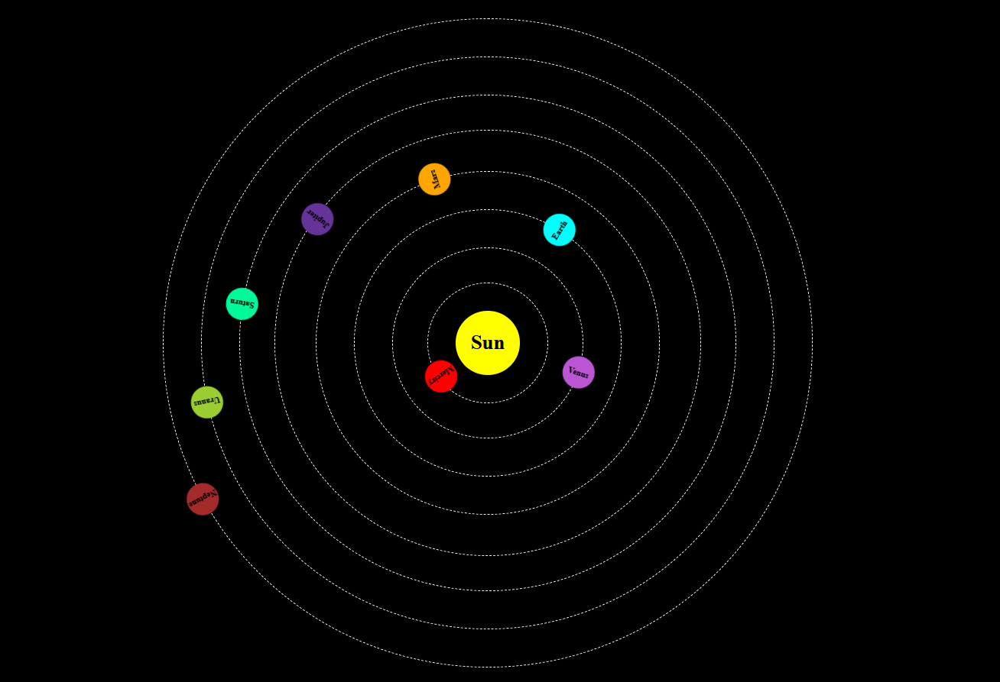

# SolarSyste WebProject

# Overview:
  This is my learning project, which I have created by using HTML and CSS.
  In this project I have used animation concept.

# Tech Stack:
- HTML
- CSS
- VS-Code

# ScreenShots:

 

# License:
- This project is for learning or educational purposes.
